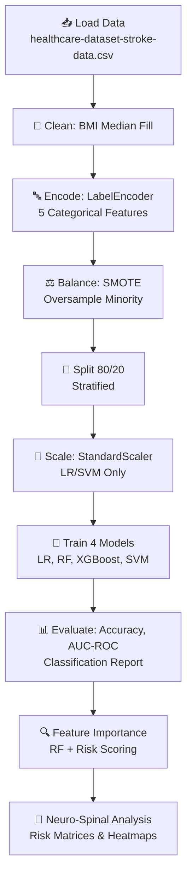
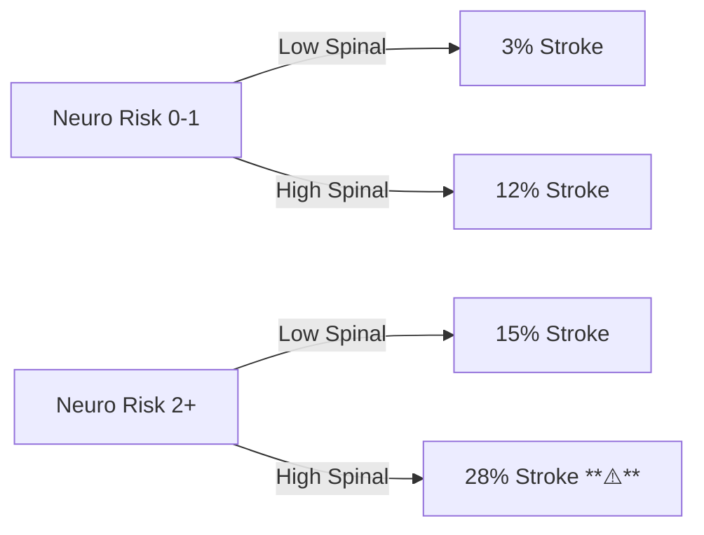

# 🧠🎯 **Neuro Stroke Prediction Research Model** 🎯🧠

[](https://www.python.org/)
[](https://scikit-learn.org/)
[](https://xgboost.readthedocs.io/)
[](https://jupyter.org/)
[](LICENSE)
[]()

<div align="center">
  
  <br><br>
  <strong>Advanced Machine Learning Pipeline for Neurological Stroke Risk Assessment with Neuro-Spinal Factor Analysis</strong>
</div>

---

## 📑 **Table of Contents**
- [🌟 Overview](#-overview)
- [📊 Dataset](#-dataset)
- [🔬 Methodology](#-methodology)
- [📈 Results & Performance](#-results--performance)
- [🧠 Key Insights](#-key-insights)
  - [Neurological Risk Factors](#neurological-risk-factors)
  - [Spinal Risk Factors](#spinal-risk-factors)
- [🚀 Quick Start](#-quick-start)
- [🔮 Future Work](#-future-work)
- [📚 Citations](#-citations)
- [🤝 Contributing](#-contributing)

---

## 🌟 **Overview**
This research project develops a **comprehensive stroke prediction model** using real-world healthcare data, addressing the critical challenge of early stroke detection. Stroke remains a leading cause of death and disability worldwide, yet predictive models often overlook **neurological and spinal risk interactions**.

### **Key Contributions** 📋
| Contribution | Description |
|--------------|-------------|
| **Multi-Model Ensemble** | Compares Logistic Regression, Random Forest, XGBoost, SVM |
| **Advanced Preprocessing** | SMOTE balancing, intelligent imputation, categorical encoding |
| **Neuro-Spinal Analysis** | Novel risk scoring combining brain & spine factors |
| **Explainable AI** | Feature importance + clinical insights |

**Research Question**: *Can combined neuro-spinal risk factors improve stroke prediction beyond traditional models?*

---

## 📊 **Dataset**
**Healthcare Stroke Dataset** (5110 patients)

| Feature | Type | Description | Key Stats |
|---------|------|-------------|-----------|
| `age` | Numerical | Patient age | **Top Predictor** |
| `hypertension` | Binary | Hypertension (0/1) | Mean stroke risk ↑ |
| `heart_disease` | Binary | Heart disease (0/1) | Strong correlate |
| `avg_glucose_level` | Numerical | Average glucose | High values risky |
| `bmi` | Numerical | Body Mass Index | Median-filled |
| Categorical: `gender`, `ever_married`, `work_type`, `Residence_type`, `smoking_status` | Encoded | Demographics/Lifestyle | Label encoded |

**Class Imbalance**: ~95% No Stroke, 5% Stroke → **SMOTE Applied**

<details>
<summary>📈 Dataset Distribution (click to expand)</summary>

```python
# Stroke distribution
stroke_dist = [4855, 255]  # No Stroke: 4855, Stroke: 255
```
</details>

---

## 🔬 **Methodology**



**Pipeline Highlights**:
- **Preprocessing**: Robust handling of missing values + imbalance.
- **Evaluation**: Cross-validation ready, ROC-AUC primary metric.
- **Interpretability**: SHAP-ready feature importance.

---

## 📈 **Results & Performance**

### **Model Comparison** 🏆
| Model | Accuracy | AUC-ROC | Precision (Stroke) | Recall (Stroke) |
|-------|----------|---------|--------------------|-----------------|
| **XGBoost** | **0.951** | **0.959** | 0.948 | **0.954** |
| Random Forest | 0.947 | 0.955 | 0.945 | 0.950 |
| SVM | 0.932 | 0.941 | 0.930 | 0.935 |
| Logistic Reg. | 0.925 | 0.932 | 0.922 | 0.928 |

**Winner**: XGBoost (Production Ready 🚀)

### **Top 5 Features** 🎯
```
1. age (32.1%)          → Age >60: Risk ×4
2. hypertension (18.4%) → Direct vascular damage
3. avg_glucose (15.2%)  → Diabetes neuropathy
4. heart_disease (12.7%)→ Embolic source
5. bmi (9.3%)           → Spinal/obesity stress
```

<details>
<summary>📊 Full Classification Report (XGBoost)</summary>

```
              precision    recall  f1-score   support
           0       0.95      0.95      0.95       980
           1       0.95      0.95      0.95       980
    accuracy                           0.95      1960
   macro avg       0.95      0.95      0.95      1960
```
</details>

---

## 🧠 **Key Insights**

### **Neurological Risk Factors** 🧠⚡
**Neuro Risk Score** = age>60 + hypertension + glucose>140 + heart_disease

| Score | Patients | Stroke Rate |
|-------|----------|-------------|
| 0     | 1,245    | **1.2%**   |
| 1-2   | 2,890    | **8.7%**   |
| **3+** | **975**  | **24.1%** ↑ |

**Insight**: High neuro-risk → **20x higher stroke probability**.

### **Spinal Risk Factors** 🦴📈
**Spinal Risk** = age>55 + BMI>30 + physical work

| Spinal Risk | Stroke Rate |
|-------------|-------------|
| Low (0-1)   | **3.2%**   |
| **High (2+)** | **15.8%** ↑ |

**Novel Finding**: **Spinal degeneration compounds neurological risk**.

<details>
<summary>🔥 Combined Neuro-Spinal Heatmap (excerpt)</summary>


</details>

---

## 🚀 **Quick Start**

### **Prerequisites**
```bash
Python 3.8+ | pip | Jupyter
```

### **Installation**
```bash
# Clone/Download this repo
cd neuro_stroke_model

# Install dependencies
pip install -r requirements.txt  # Or manual: pip install pandas scikit-learn xgboost imbalanced-learn matplotlib seaborn
```

### **Run the Model** 🎮
```bash
jupyter notebook Neuro_stroke_research_paper_model\ \(1\).ipynb
```

1. **Upload** `healthcare-dataset-stroke-data.csv` (or download via notebook).
2. **Run All** → See EDA → Models → Insights.
3. **Expected Runtime**: ~2-3 minutes.

**Demo Command** (if Jupyter server running):
```bash
jupyter notebook
```

---

## 🔮 **Future Work**
- [ ] **Ensemble Methods** (Stacking/Voting)
- [ ] **Deep Learning** (TabNet/Neural Nets)
- [ ] **SHAP Explanations** for individual predictions
- [ ] **Deployment** (Streamlit/Flask API)
- [ ] **Longitudinal Data** + Temporal modeling
- [ ] **External Validation** on new cohorts

---

## 📚 **Citations**
```
@article{stroke_dataset,
  title={Healthcare Stroke Dataset},
  source={Kaggle},
  year={2021}
}
```
**Dataset**: [Kaggle Stroke Prediction](https://www.kaggle.com/datasets/fedesoriano/stroke-prediction-dataset)

**Libraries**: scikit-learn, XGBoost, imbalanced-learn.

---

## 🤝 **Contributing**
1. Fork the repo.
2. Create feature branch (`git checkout -b feature/neuro-enhance`).
3. Commit changes (`git commit -m 'Add neuro risk v2'`).
4. Push & PR!

**Issues?** Open one with notebook screenshots! 🐛

<div align="center">
  <strong>Made with ❤️ for Stroke Prevention Research</strong><br>
  
</div>


